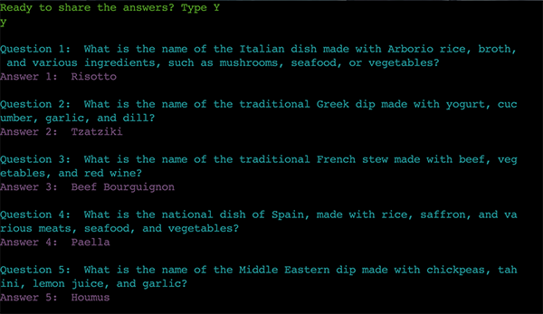

# Portfolio Project 3 - Quiz Master

Quiz Master is a command line program developed in Python which provides a simple and efficient way of running a pub quiz to help ensure that the quiz runs smoothly. The user can add teams, decide how many questions and from which categories they would like to use, a winnings pot will be calculated and the questions displayed. When the quiz has finished, the user can enter scores for each team and a leaderboard is displayed together with the winning team.

[View Live App](https://quizmaster2023-1748e46cdf59.herokuapp.com/)

## CONTENTS

- [Features](#features)
    - [Existing Features](#existing-features)
    - [Future Features](#future-features)
- [Planning](#planning)
    - [Flowchart](#flowchart)
    - [User Stories](#user-stories)
- [Technologies Used](#technologies-used)
    - [Languages Used](#languages-used)
    - [Python Modules](#python-modules)
    - [Programs Used](#programs-used)
- [Testing](#testing)
    - [Manual Testing](#manual-testing)
    - [PEP8 Python Linter](#pep8-python-linter)
    - [Solved Bugs](#solved-bugs)
    - [Unfixed Bugs](#unfixed-bugs)
- [Deployment](#deployment)
    - [Version Control](#version-control)
    - [Heroku Deployment](#heroku-deployment) 
    - [Run Locally](#run-locally)
    - [Fork Project](#fork-project)
- [Content and Resources](#content-and-resources)
- [Acknowledgments](#acknowledgements)

## Features
### Existing Features
#### Initial Screen
This is the initial screen that you will see when the program starts.  It displays a welcome message using a typewriter effect, together with the instructions for use. You are then prompted to enter a team name.

### Add Team
This section allows you to add teams.  Firstly, you need to enter the team name and then you will be asked to enter the size of the team. You can add as many teams as you like by entering Y when asked if you would like to add another team. Once you have finished adding teams you can enter N and it will tell you how many people are in each team.
- Input validation and error checking
    - Add another team? Y/N.  Either Y or N must be entered
    - You cannot submit a blank team name
    - Team name must be less than 30 characters
    - The team size should be between 1-4 and must be a number

### Add Play Amount

Once you have all your teams added, you can then add the play amount i.e. the fee per person. This will be used to calculate the winnings for the game.
- Input validation and error checking
    - A number must be entered 

### Retrieve the Questions
To retrieve the question, you are asked if you would like to add a category, when you enter Y you are presented with a list of categories to choose from. Once you have made your selection you will be asked how many questions you would like.  You can add as many categories as you like. When you are finished you can enter N when prompted to add another category. 

A list of questions for the Quiz Master to read out will then be shown. No answers will be shown here to eliminate any potential cheating!

- Input validation and error checking
    - Add a category? Y/N. Either y or n must be entered
    - Select a category. A number between 1-8 must be entered
    - Quantity of questions. A number between 1-20 must be entered

### Show Answers
After the questions have been printed, a prompt asking if you are ready to share the answers will appear.  Once you are ready, you can enter Y and a list of the questions, together with the answers will be shown for the Quiz Master to share with the players.

- Input validation and error checking
    - Anything other than Y will result in the question being asked again

### Add Score
Once all the teams have marked their quiz sheets, the quiz master can then enter the scores into the program. They will be prompted to enter a score for each team. Once this has been done a leaderboard will appear and the winning team declared.

- Input validation and error checking
    - A number must be entered

### Future Features
- In the event of a draw, you could go onto a tie break round.
- When the questions are displayed, they could be broken up into categories

## Planning
To begin planning this project I created a flowchart and then took to paper and pen to break each feature down into functions and plan what each function would do and which inputs would need to be validated.  I had originally planned to use Google Sheets to hold information regarding team names, sizes, scores and questions but decided to switch to JSON as suggested by my mentor.

### Flowchart

### User Stories
- I need to be able to add teams
- I need to be able to calculate the winnings
- I need to be able to access a range of questions and their answers
- I need to know who the winner is

## Technologies Used 
### Languages Used 
This app was built using Python and utilises JSON for the data.

### Python Modules
- [json](https://docs.python.org/3/library/json.html) - to load json file
- [Random](https://docs.python.org/3/library/random.html) - to get random questions from category selection
- [Colorama](https://pypi.org/project/colorama/) - to add colour to the terminal
- [Tabulate](https://pypi.org/project/tabulate/) - to present information in a table format
- [Sys](https://docs.python.org/3/library/sys.html) - required for typewriter effect
- [Time](https://docs.python.org/3/library/time.html) - required for typewriter effect

### Programs Used

- [Lucid Chart](https://lucid.app/) - for creating flowcharts
- [Git](https://git-scm.com/) - a version control system for tracking changes
- [GitHub](https://github.com/) - a code hosting platform for version control
- [Gitpod](https://www.gitpod.io/) - a cloud development environment
- [Heroku](https://heroku.com//) - for deployment of app
- [TinyPNG](https://tinypng.com/) - to compress images
- [Shields](https://shields.io/) - to generate badges for inclusion in the README field
- [PEP8 Python Validator](https://pep8ci.herokuapp.com/) - to validate Python code
- [Birme](https://www.birme.net/?no_resize=true&image_format=webp) - Convert images to WebP format

## Testing
### Manual Testing
| Feature:  | Initial Screen          |
|-----------|-------------------------|
| Expected: | When the program runs, the welcome message, description and instructions appear.|
| Result:   | The feature responded as expected.|
| Fix:      | No fix needed.|

| Feature:  | Add Team                      |
|-----------|-------------------------------|
| Expected: | The flow of this section is: Add Team Name => Add Time Size => Add Another Team? Y/N.  If Y is pressed it will loop back to Add Team Name. If N is pressed it will proceed to Add Play Amount.|
| Result:   | The feature responded as expected but I found a bug with the "Add Another Team?" loop.|
| Fix:      | [See Solved Bugs No. 1 below](#solved-bugs)|

| Feature:  | Add Play Amount               |
|-----------|-------------------------------|
| Expected: | Add fee per person and calculate the winnings.|
| Result:   | The feature responded as expected.|
| Fix:      | No fix needed.|

| Feature:  | Retrieve the Questions        |
|-----------|-------------------------------|
| Expected: | The flow of this section is: Add a Category? Y/N => Select a Category => How many questions. If Y is pressed it will loop back to Add a Category. If N is pressed it will display the questions.|
| Result:   | The feature responded as expected aside from a bug in the Add a Category validation loop.|
| Fix:      | [See Solved Bugs No. 2 below](#solved-bugs)|

| Feature:  | Show Answers                  |
|-----------|-------------------------------|
| Expected: | You need to enter Y to show the answers. Anything other than Y will result in the question being asked again.|
| Result:   | The feature responded as expected.|
| Fix:      | No fix needed.|

| Feature:  | Add Score                     |
|-----------|-------------------------------|
| Expected: | Add a score for each team. Show leaderboard and declare a winner|
| Result:   | The feature responded as expected but there was a bug in declaring a winner|
| Fix:      | [See Solved Bugs No. 3 below](#solved-bugs).|

### PEP8 Python Linter
I used the Code Institute PEP8 Python Linter to validate my Python code and ensure it was free from errors.

### Solved Bugs
1. There was an issue with the validation loop. When asked "Add another Team?" If you pressed anything other than Y or N, it would tell you that it is invalid input but it would then ask you to "Enter a Team Name" rather than asking if you wanted to add another team. I fixed this by re-writing the validation code so that if you pressed Y it would break the loop. If you pressed N, it would return the teams, else it would print an invalid input message and return you to the start of the loop. In my previous code, the else statement would call the add_team function again which is why it was breaking.

2. The issue with the retrieve questions loop was similar to issue No. 1 above except in the else statement I was using recursion and was calling the get_questions function so I removed this to solve it. 

3. The winner declared was incorrect. I found that it was finding the largest key i.e the team name, rather than the largest score. I fixed this by using the get() method to return the value of the key. There was a second bug found when declaring a winner - there could only be one winning team and it would only pick up the first highest score. To fix this, I created a winning_teams list using list comprehension and an if statement to see if the length of the winning team list was equal to 1 and if so, declare a winner, otherwise declare a draw and show the winning teams.

### Unfixed Bugs
No unfixed bugs.

## Deployment 
### Version Control
The site was created using the Visual Studio Code editor and pushed to GitHub to the remote repository "quizmaster".

The following git commands were used throughout development to push code to the remote repository:

git add . - This command was used to add files to the staging area before they are committed.

git commit -m “commit message” - This command was used to commit changes to the local repository queue.

git push - This command was used to push all committed code to the remote repository on GitHub.

### Heroku Deployment
The site was deployed to Heroku using the following steps:

- Navigate to heroku.com and create an account
- Click the "New" button in the top right corner
- Select "Create new app"
- Enter the app name
- Select Region and click "Create app"
- Go to the Settings tab and click "Reveal config vars"
- Add any necessary config vars
- Click the Deploy tab
- Scroll down to Connect to GitHub and sign in / authorize when prompted
- Find the repository you want to deploy and click "Connect"
- Scroll down to Manual deploy and choose the main branch
- Click "Deploy Branch"
- The app should now be deployed and you can click on the "View" button to view the live site

### Run Locally
Navigate to the GitHub Repository you want to clone:

- Click on the "Code" drop down button
- Click on HTTPS
- Copy the repository link to the clipboard
- Open your IDE of choice (git must be installed for the next steps)
- Type git clone copied-git-url into the terminal
- The project will now have been cloned on your local machine for use.

### Fork Project
Forks are used to either propose changes to someone else's project or to use someone else's project as a starting point for your own idea.

- Navigate to the GitHub Repository you want to fork
- On the top right of the page under the header, click the "Fork" button
- This will create a duplicate of the full project in your GitHub Repository.

## Content and Resources
The following resources were used in order help with any challenges that arose
- Code Institute course content
- w3 Schools
- Real Python
- Stack Overflow
- Geeks for Geeks
- [Tutoral for typewriter effect](https://learnlearn.uk/python/python-typewriter-code/)
- [Guidance on how to create a dictionary from two lists](https://www.geeksforgeeks.org/python-convert-two-lists-into-a-dictionary/)
- [iStockPhoto](https://www.istockphoto.com/) - background image was purchased from iStockPhoto###

## Acknowledgements

I would like to acknowledge the tutors from the Code Institute's Tutor Support for helping me solve some of the issues I faced and my mentor, Daisy Mc Girr for all of her guidance and support.